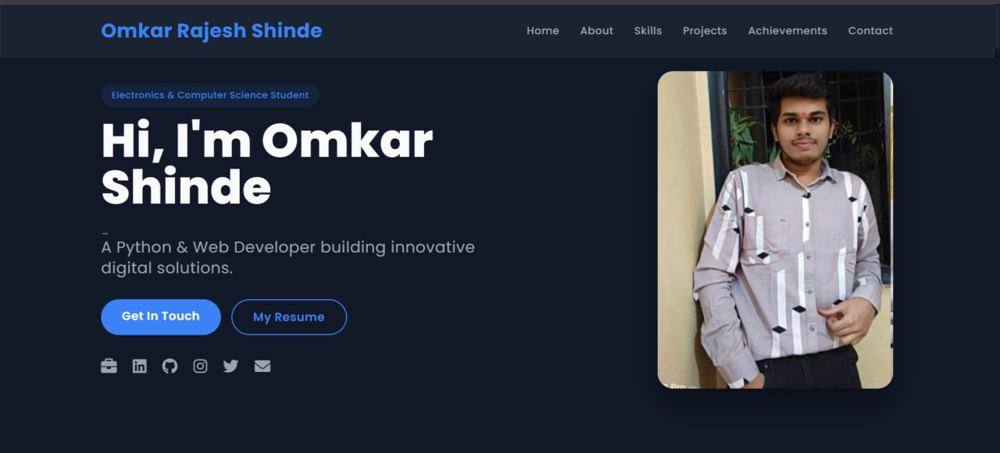

# Omkar Shinde - Personal Portfolio Website

## 📌 Overview
This is my personal portfolio website showcasing my skills, projects, achievements, and contact information.  
It is built using **HTML, CSS, JavaScript**, and deployed with **Vercel** for fast and reliable hosting.

**Live Demo:** [omkar-shinde.vercel.app](https://omkar-shinde.vercel.app/)

---

## 🚀 Features
- **Responsive Design** – Works seamlessly on desktop, tablet, and mobile devices.
- **Smooth Animations** – AOS-based scroll animations for an engaging experience.
- **Projects Showcase** – Details of my major and mini projects with tech stacks.
- **About Me Section** – Quick introduction and career goals.
- **Contact Form** – Easy way for visitors to reach out.
- **Fast & Optimized** – Hosted on Vercel with minimal load times.

---

## 🛠 Tech Stack
- **Frontend:** HTML5, CSS3, JavaScript
- **Animations:** [AOS (Animate on Scroll)](https://michalsnik.github.io/aos/)
- **Hosting:** [Vercel](https://vercel.com/)

---

## 📂 Project Structure
```plaintext
portfolio/
│
├── index.html        # Main page
├── style.css         # Stylesheet
├── script.js         # JavaScript logic
├── assets/           # Images, icons, and other media
└── README.md         # Documentation
---
```
## 📌 Results
```
Here’s how the portfolio looks when deployed:


